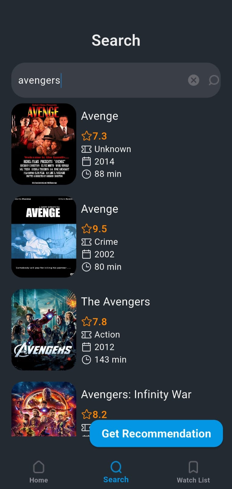

# movie_cellula
A Flutter-based movie application integrated with Gemini AI for dynamic recommendation generation.
Users can search for movies, view details, manage watchlists, and get recommendations tailored to their viewing habits.

## Main packages used

- [htp](https://pub.dev/packages/http) to make integration with API
- [flutter_bloc](https://pub.dev/packages/flutter_bloc) as state management
- [injectable](https://pub.dev/packages/injectable) to make dependency injection
- [flutter_gemini](https://pub.dev/packages/flutter_gemini) to integrate with gemini
- [shared-preferences](https://pub.dev/packages/shared_preferences) for storing data
- [dartz](https://pub.dev/packages/dartz) for functional programming
- [equatable](https://pub.dev/packages/equatable) to compare objects in Dart

## App ScreenShots

Here are some screenshots for the application:

## Folder structure
I Have applied clean architecture concept With MVVM architecture

### 📽️ Demo Video

[▶️ Watch the video]([https://drive.google.com/file/d/1PHQJiHa9X1DURdIMLt4QS6nCzEEX7W9C/view?usp=drive_link](https://drive.google.com/file/d/1PHQJiHa9X1DURdIMLt4QS6nCzEEX7W9C/view?usp=sharing))
